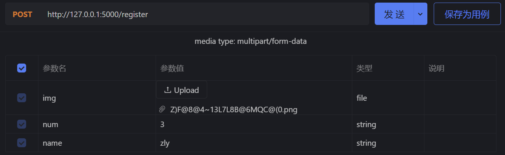
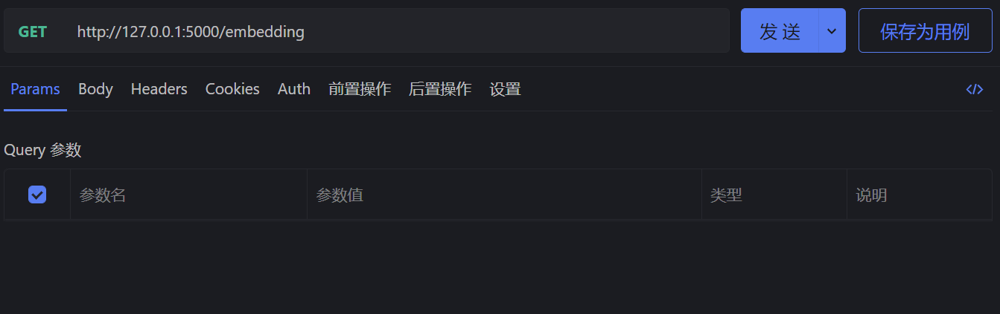
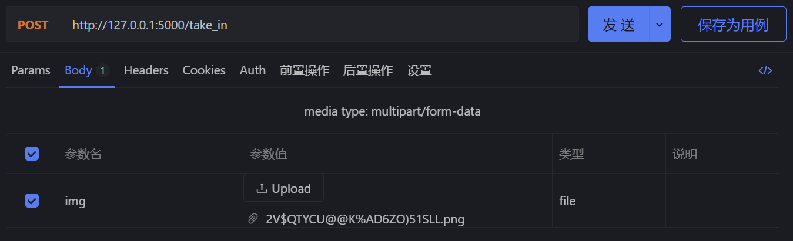
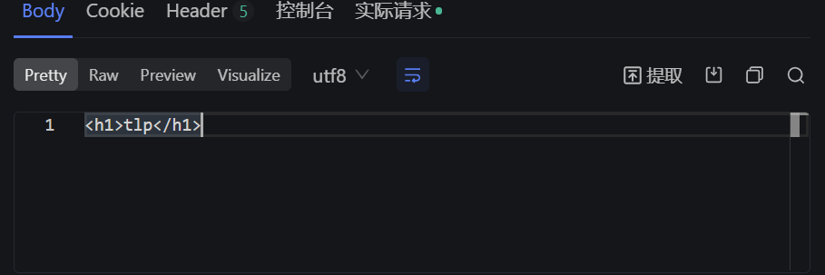

# 整体模块
---
## 主要组成
- 人脸图像登记
  - 图像传输
    - 通过 post请求 上传图片与相关初始化数据
    - 注意命名规则
      - { 'name':'Leon',
          'num' :'2',
          'img' :img_file.jpg
        }
      - Leon上传的第二张照片（用于登记）
    - 每次只上传一张照片
---
- 数字图像编码
  - 多位新用户 数据上传完成后 通过该函数对图像库进行更新
  - 访问 http://127.0.0.1:5000/embedding 即可实现重载
  - 

---
- 用户访问 - 检测来者
  - 图像传输
    - 通过 post请求 上传待检测图片
    - 每次只上传一张照片即可
  - 返回 检测结果
    - 此人为特朗普
